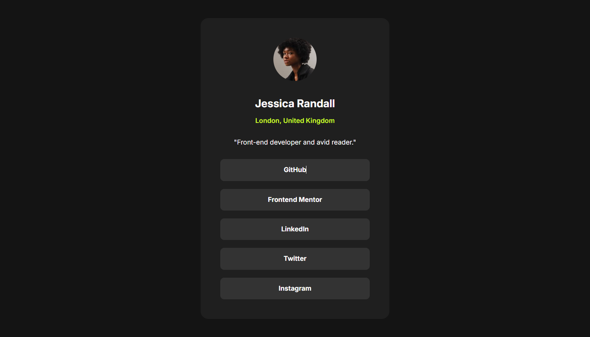
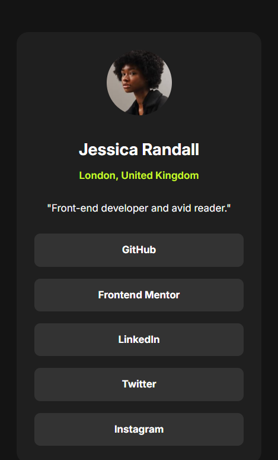

# Frontend Mentor - Social links profile solution

This is a solution to the [Social links profile challenge on Frontend Mentor](https://www.frontendmentor.io/challenges/social-links-profile-UG32l9m6dQ). Frontend Mentor challenges help you improve your coding skills by building realistic projects. 

## Table of contents

- [Frontend Mentor - Social links profile solution](#frontend-mentor---social-links-profile-solution)
  - [Table of contents](#table-of-contents)
  - [Overview](#overview)
    - [Screenshot](#screenshot)
    - [Links](#links)
  - [My process](#my-process)
    - [Built with](#built-with)
    - [What I learned](#what-i-learned)
  - [Author](#author)

## Overview

### Screenshot

Desktop

Mobile

### Links

- Solution URL: [Social links profile solution](https://github.com/st0272/fm-social-links-profile/)
- Live Site URL: [Product social links profile solution](https://github.com/st0272/fm-social-links-profile/)

## My process

### Built with

- Semantic HTML5 markup
- CSS reset
- Flexbox
- CSS Grid
- Mobile-first workflow

### What I learned

Use grid centering card item.

## Author

- Website - [Suzunatsu Website](https://www.suzunatsu.com?utm_source=gh)
- Frontend Mentor - [@st0272](https://www.frontendmentor.io/profile/st0272)
- Twitter - [@suzuantsu_](https://www.twitter.com/suzuantsu_)

